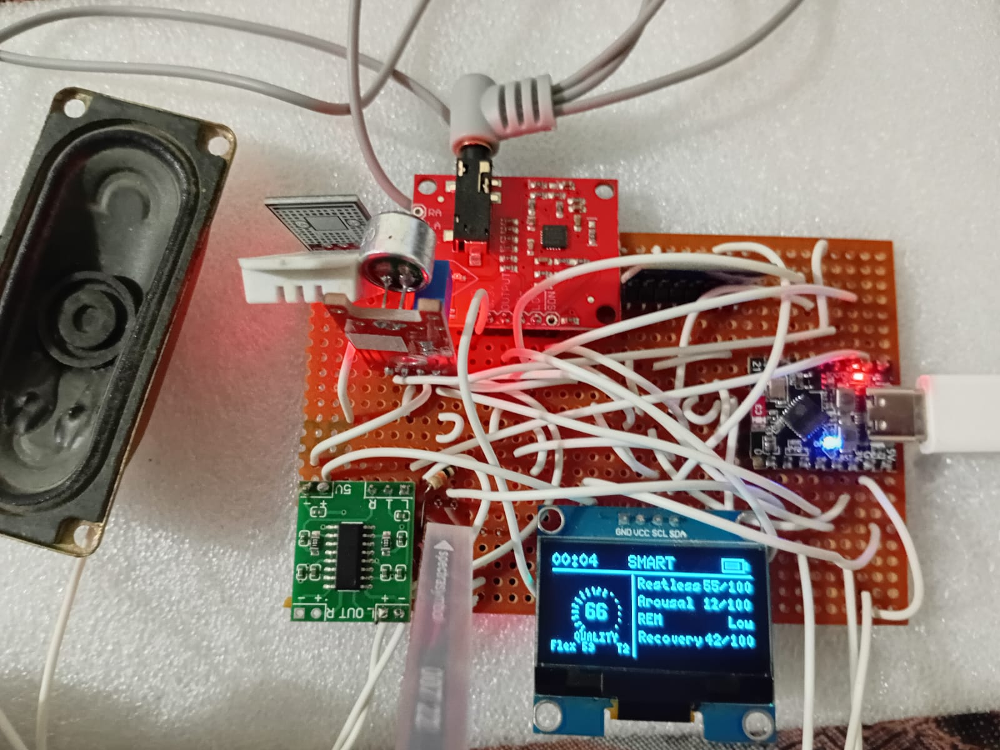

# Wearable Sleep Quality Monitor



Wearable-oriented sleep quality monitor (compact battery-powered sensing prototype) showing Restless / Arousal / REM / Recovery scores on OLED with optional audio cues.

**Build window:** 3 Aug – 2 Sep 2026 (portfolio documentation)

## Features

- Prototype-faithful pin map and BOM
- Upwork-safe: no live Wi-Fi / MQTT credentials in the repo
- Example secrets template only (`secrets.example.h`)

## Bill of materials

- MCU (ESP32 / Arduino)
- OLED display
- Mic / sound sensor
- Small speaker + amp
- Perfboard

## Pin map

| Signal | GPIO |
|---|---|
| OLED I2C | 21 / 22 |
| Mic analog | 34 |
| Speaker PWM | 25 |

## Flash / run

```bash
cd firmware
cp secrets.example.h secrets.h   # then edit locally
pio run -t upload
pio device monitor
```

## Safety

Never commit `secrets.h`. See the repo root [UPWORK-SHARE.md](UPWORK-SHARE.md).
